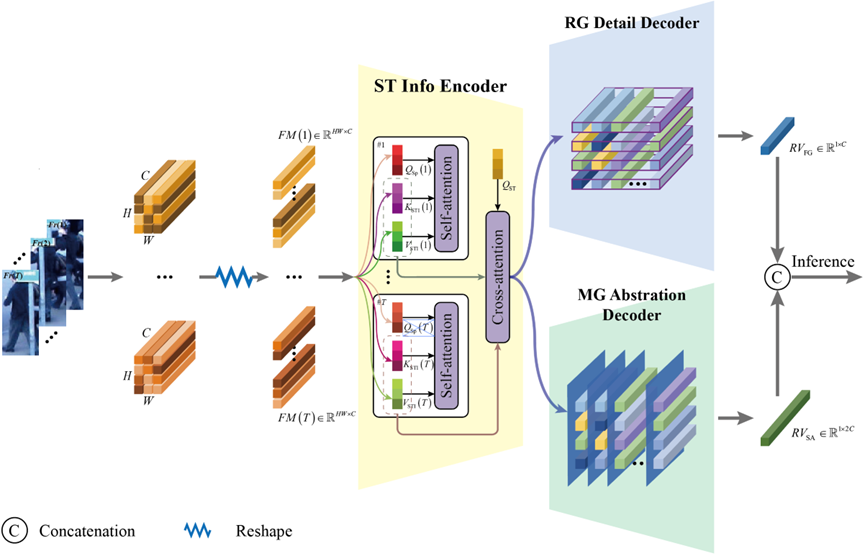

# STICC for Video-based Person Re-identification
Official PyTorch implementation of "Spatiotemporal Information Complementary Condensation for Video-based Person Re-identification". 

## Overview

## Inference Pipeline



The STICC architecture include:
- **Common Info Encoding**: Detects pedestrian coordinates.
- **Individual-Specific Info Encoding**: Detects pedestrian coordinates.
- **Relevance-Guided Detail Decoder**: Detects pedestrian coordinates.
- **Memory-Guided Abstraction Decoder**: Detects pedestrian coordinates.

The common Info encoding is collaboratively optimized together with the individual-specific Info encoding and the decoders. The fine-grained and semantic-aware representation vectors are concatenated to form a comprehensive representation for person re-ID inference. 

## Setup

### Installation

Clone and set up the STICC repository

```
git clone https://github.com/learning/STICC/main
cd STICC
conda create -n STICC python=3.7
conda activate STICC
pip install -r requirements.txt
```

Data Preparation
- **PARI-1581**:Download PRAI-1581 dataset from this link.
- **Occluded Duke**:Download the dataset from Baidu disk or from the original dataset link.

### Usage

2.Inference.


    | Method | MAE | RMSE | WRAE| 
    | ------ | --- | --- | --- |
    | Paper  | 8.86 | 17.69| 12.6|
    | Repo   | 8.64 | 18.70| 11.76|
    ||
