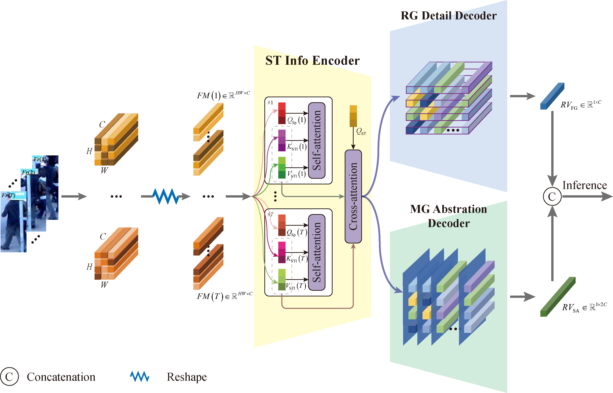

# STICC for Video-based Person Re-identification
Official PyTorch implementation of "Spatiotemporal Information Complementary Condensation for Video-based Person Re-identification". 

## Overview

## Inference Pipeline



The STICC architecture include:
- **Common Info Encoding**: Detects pedestrian coordinates.
- **Individual-Specific Info Encoding**: Detects pedestrian coordinates.
- **Relevance-Guided Detail Decoder**: Detects pedestrian coordinates.
- **Memory-Guided Abstraction Decoder**: Detects pedestrian coordinates.

The common Info encoding is collaboratively optimized together with the individual-specific Info encoding and the decoders. The fine-grained and semantic-aware representation vectors are concatenated to form a comprehensive representation for person re-ID inference. 

## Setup

### Installation

Clone and set up the STICC repository

```
git clone https://github.com/learning/STICC/main
cd STICC
conda create -n STICC python=3.7
conda activate STICC
pip install -r requirements.txt
```

Data Preparation
- **PARI-1581** : Download PRAI-1581 dataset from this link.
- **Occluded Duke** : Download the dataset from Baidu disk or from the original dataset link.

### Usage

2.Inference.

   * Evaulations on PRAI-1581 Dataset. The results are as follows:

| Dataset | Rank-1 | Rank-5 | Rank-10| Rank-20|
| ------ | --- | --- | --- | --- |
| BiCNet-TKS | 48.9 | 74.7| 81.3| 87.6|
| PSTA | 52.4 | 78.5| 85.1| 88.9|
| STMN | 60.5 | 84.3| 90.6| 93.7|
| GRL | 59.0 | 83.3| 88.4| 93.9|
| SiNet  | 46.1 | 74.4| 82.5| 88.6|
| MSINet | 56.8 | 76.0| 81.8| 87.5|
| Ours | 66.3 | 87.1| 91.4| 94.2|
||

   * Evaulations on Occluded Duke Dataset.The results are as follows:

| Dataset | Rank-1 | Rank-5 | mAP|
| ------ | --- | --- | --- |
| BiCNet-TKS | 33.6 | 49.5| 33.4|
| PSTA | 42.9 | 62.7| 43.4|
| STMN | 42.2 | 62.7| 43.7|
| GRL | 43.2 | 57.3| 43.4|
| SiNet  | 40.0 | 58.0| 40.0|
| MSINet | 40.3 | 62.4| 42.8|
| Ours | 57.1 | 75.6| 56.6|
||

# Acknowledgement

We thank the authors of [PAT](https://arxiv.org/pdf/2106.04095) and [STMN](https://cvlab-yonsei.github.io/projects/STMN) for their excellent work.
